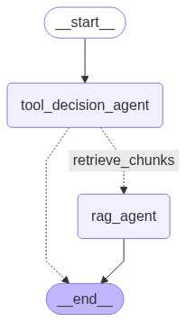

# Muti-Agent-RAG-System

* Engineered a LangGraph-based system with multiple agents that dynamically decide between document retrieval and web search using LLM-driven reasoning based on query context and content relevance.

* Integrated FastAPI for PDF upload and question handling, with document parsing, embedding, and similarity search; implemented intelligent fallback from document context to web tools when information was insufficient.

  

## 📁 Project Structure

| File           | Description |
|----------------|-------------|
| `app.py`       | Sets up the FastAPI app and defines the endpoint for PDF upload and question answering. |
| `main.py`      | Runs the whole RAG workflow to answer questions. |
| `data_process.py` | Handles PDF parsing, text chunking, and vector store management. |
| `tools.py`     | Provides document and web search tools for the agentic workflow. |
| `agents.py`    | Defines agent logic and state. |
| `workflow.py`  | Configures and runs the LangGraph-based agent workflow. |
